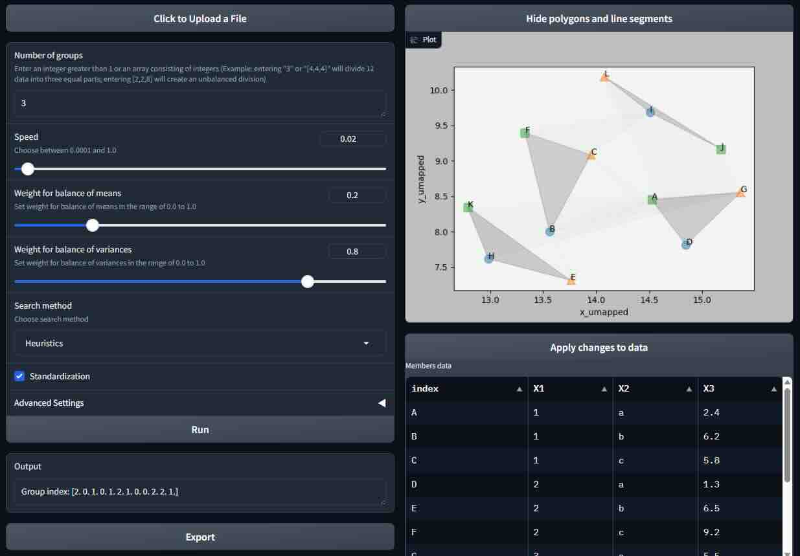
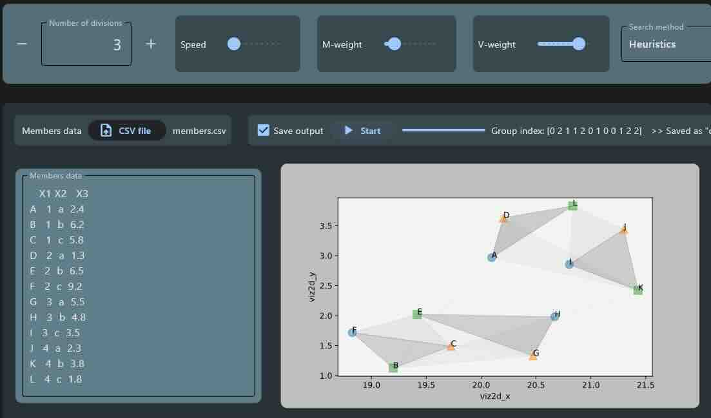

# OTG (Optimal Transport Grouping)

[English](README.en.md) &nbsp;&nbsp;&nbsp;&nbsp;&nbsp; [日本語](README.jp.md)

## Overview
This is a Python program for generating groupings as uniformly as possible by using the optimal transport technique.

## Usage
- Without a Python runtime environment
    - On Windows, download "[otg_gradio_win.7z](https://github.com/tanaken-basis/otg/raw/main/otg_gradio_win.7z)" and decompress it, double-click "otg_gradio.exe" to start the web application for automatically generating groupings. It may take 2-3 minutes to start the web application. This web application runs on a local machine.
        - If "Windows protected your PC", click "More Info" and click "Run Anyway".
    - On Mac (Apple silicon), download "[otg_gradio_mac.7z](https://github.com/tanaken-basis/otg/raw/main/otg_gradio_mac.7z)" and decompress it, double-click "otg_gradio" to start the web application for automatically generating groupings. It may take 2-3 minutes to start the web application. This web application runs on a local machine.
        - If you cannot run the application on your Mac, type `sudo spctl --master-disable` in the terminal to allow all applications to run. You can return to the original state by typing `sudo spctl --master-enable`.
- Using Python programs
    - By running "otg_gradio.py" in Python, you can start the web application created by Gradio to generate groupings automatically. You can adjust parameters for automated generation, execute calculations to generate results and save calculated results to files. You can run the web application on a local machine.
    - By running "otg_flet.py" in Python, you can start the GUI application created by Flet to generate groupings automatically. You can adjust parameters for automated generation, execute calculations to generate results and save calculated results to files.
    - The same program is also written in the notebook file "otg.ipynb". 

## Notes on using Python programs
- This code uses the Python library UMAP to visualize data. Please refer to https://github.com/lmcinnes/umap for installation information.
- This code uses the Python library Gradio to create the web app. Please refer to https://github.com/gradio-app/gradio for installation information.
- This code uses the Python library Flet to create the GUI app. Please refer to https://github.com/flet-dev/flet for installation information.

## Samples of execution screens

#### Gradio

#### Flet

